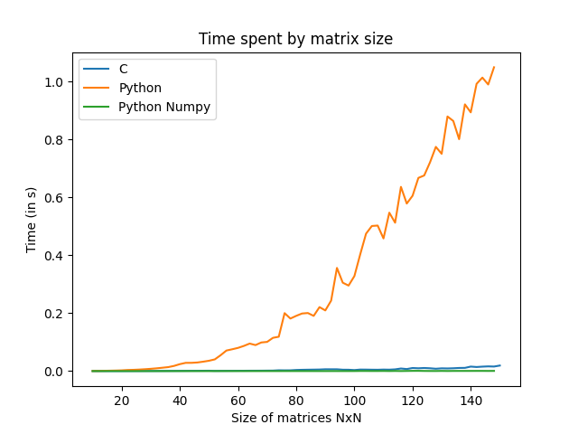
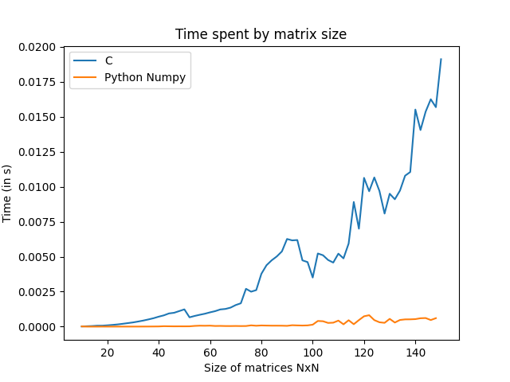

# C vs Python

Comparison in processing speed between the two languages C and Python.

## Matrix multiplication

When comparing the same implementations, C outperforms Python in processing speed. However, when compared to an optimized Python library, such as numpy, it compares favorably to Python, due to the optimization techniques used in numpy for matrix multiplication.

Anyway, numpy uses wrapped C code to run faster. No debate, C wins.  
  
  



### Same implementations

The implementation on both C and Python languages uses simple addition and multiplication in for loops.

C:
```
// Multiply m1 with m2 into res
void matrixMult(int** m1, int** m2, int** res, int size)
{
    for(int i = 0; i < size; i++) {
        for(int j = 0; j < size; j++) {
            for(int k = 0; k < size; k++) {
                res[i][j] += m1[i][k] * m2[k][j];
            }
        }
    }
}  
```

Python:
```
# Multiply m1 with m2 into res
def matrixMult(m1, m2, res, size):
    for i in range(size):
        for j in range(size):
            for k in range(size):
                res[i, j] += m1[i, k] * m2[k, j]        
```